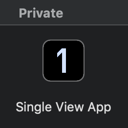

# ios-templates

This repository contains custom Xcode file and project templates.



## Installation

```sh
./install.sh
```

## How to add other templates

The iOS templates are in sub-folders here:

- `/Applications/Xcode.app/Contents/Developer/Platforms/iPhoneOS.platform/Developer/Library/Xcode/Templates/File Templates`
- `/Applications/Xcode.app/Contents/Developer/Platforms/iPhoneOS.platform/Developer/Library/Xcode/Templates/Project Templates`

Copy other templates into the `Project Templates` or `File Templates` folder in this repository.

```sh
cp -R ${other-template-path} ./Project\ Templates/Private
```
